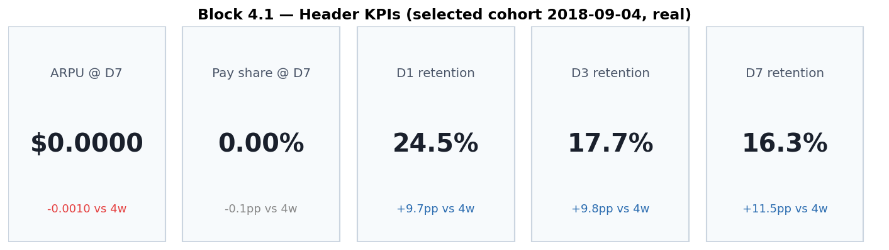
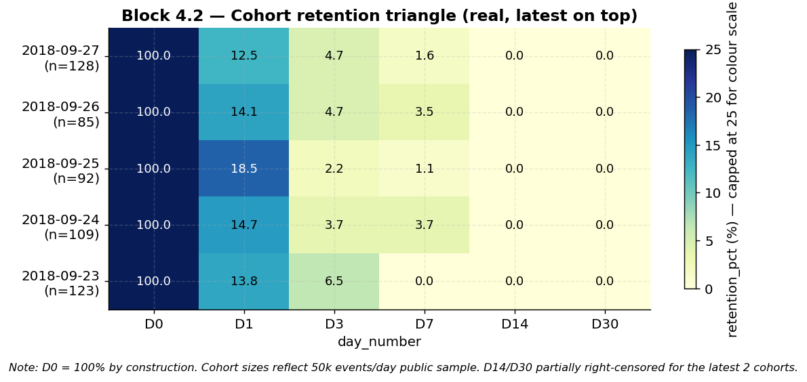
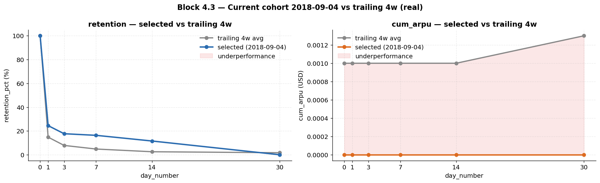
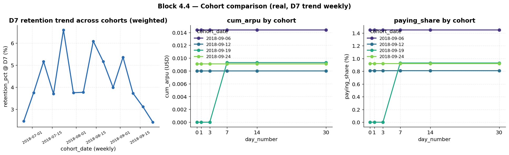
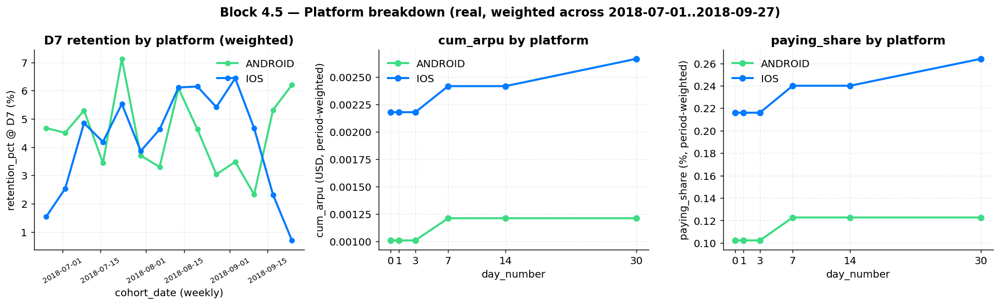

# Part 4 — Dashboard sketch: Cohort Health

Cohort Health — дашборд про retention и монетизацию новых игроков в первые дни. Документ описывает, какой запрос продакта закрывается, как он раскладывается на метрики и чарты, какие принципы визуализации лежат в основе layout'а и какие компромиссы при этом приняты.

---

## 1. Запрос продакта

> «Нам надо понять, как себя ведут новые игроки в первые дни. Хотим видеть retention, понимать монетизацию по когортам. Сделай нам простой дашборд, чтобы я мог сам туда заходить и смотреть.»

Из запроса получаются четыре требования к дашборду — каждое замыкается на конкретные блоки страницы:

1. **Когортный взгляд.** «Как себя ведут новые игроки» = смотрим декаю по `day_number` для каждой когорты, не календарные тренды.
2. **Retention + монетизация на одной странице.** «Хотим видеть retention, понимать монетизацию по когортам» = на странице должны быть оба класса метрик. Retention раскладывается на D1/D3/D7 (плашка 3.1) + retention-кривые (3.3 левая панель, 3.4 D7-trend). Монетизация — на cum_arpu и paying_share (плашка 3.1, cum_arpu в 3.3 правой панели, paying_share в 3.4 и 3.5). Платформенный разрез повторяет ту же тройку метрик в блоке 3.5.
3. **Первые дни.** «В первые дни» сужает горизонт до D0..D7, поэтому KPI-плашка собрана из D1/D3/D7 + ARPU@D7 + PAY%@D7 — а не из «классической F2P-тройки» D7/D14/D30. D14/D30 остаются на cohort triangle и curve-чартах как контекст (там horizon до 30), но не попадают в первый взгляд.
4. **Self-serve.** «Сделай простой, чтобы я мог сам заходить» = одна страница, фильтры (период + платформа), default-вью без настройки.

---

## 2. Принципы визуализации

Три правила, на которых стоит layout:

1. **Default-вью — последняя полная когорта.** Заходишь на дашборд — видишь последнюю когорту (top-of-stack в triangle, выделена в curve-чартах, числа в KPI-плашке). Никакой настройки фильтров не требуется. Если продакт хочет «прошлую неделю» — двигает range-picker.
2. **Сравнение всегда против trailing 4-week avg.** Устойчивее точечной когорты-vs-когорты (избегаем сравнения с шумной соседкой) и при этом достаточно свежий (не размазан годом). Применяется в KPI-дельтах (Block 3.1) и в линии baseline на curve-чартах (Block 3.3).
3. **Сначала общие метрики — потом срезы.** Сверху на странице агрегированные числа без разбиения, ниже — те же метрики в разрезе платформы. В перспективе платформенный блок (3.5) уезжает под фильтр (`install_platform`) и страница укорачивается до 3.1–3.4. Сейчас держим явно — продакту легче увидеть «есть ли вообще split», чем переключать фильтр.

---

## 3. Схема дашборда

```
┌───────────────────────────────────────────────────────────────────────┐
│  COHORT HEALTH                       Filters: [date range][platform]  │
├───────────────────────────────────────────────────────────────────────┤
│  ┌──────┐ ┌──────┐ ┌──────┐ ┌──────┐ ┌──────┐                         │
│  │ARPU  │ │ PAY% │ │  D1  │ │  D3  │ │  D7  │              3.1 KPIs   │
│  │ @D7  │ │  @D7 │ │      │ │      │ │      │                         │
│  └──────┘ └──────┘ └──────┘ └──────┘ └──────┘                         │
├───────────────────────────────────────────────────────────────────────┤
│           ┌──────────────────────────────────────────────┐            │
│           │  COHORT TRIANGLE (latest cohort on top)      │  3.2       │
│           │  Y = cohort_date desc, X = day_number        │            │
│           └──────────────────────────────────────────────┘            │
├───────────────────────────────────────────────────────────────────────┤
│           ┌──────────────────────────────────────────────┐            │
│           │  CURRENT vs TRAILING 4W AVG  (2-panel)       │  3.3       │
│           │  ┌─────────────┐ ┌─────────────┐             │            │
│           │  │ retention   │ │ cum_arpu    │             │            │
│           │  │ vs 4w base  │ │ vs 4w base  │             │            │
│           │  └─────────────┘ └─────────────┘             │            │
│           └──────────────────────────────────────────────┘            │
├───────────────────────────────────────────────────────────────────────┤
│           ┌──────────────────────────────────────────────┐            │
│           │  COHORT COMPARISON                           │  3.4       │
│           │  ┌─────────┐ ┌─────────┐ ┌─────────┐         │            │
│           │  │D7 trend │ │cum_arpu │ │paying_  │         │            │
│           │  │ × cohort│ │by cohort│ │share    │         │            │
│           │  └─────────┘ └─────────┘ └─────────┘         │            │
│           └──────────────────────────────────────────────┘            │
├───────────────────────────────────────────────────────────────────────┤
│           ┌──────────────────────────────────────────────┐            │
│           │  PLATFORM BREAKDOWN (iOS vs Android)         │  3.5       │
│           │  ┌─────────┐ ┌─────────┐ ┌─────────┐         │            │
│           │  │D7 trend │ │cum_arpu │ │paying_  │         │            │
│           │  │ × plat  │ │ × plat  │ │share×pl │         │            │
│           │  └─────────┘ └─────────┘ └─────────┘         │            │
├───────────────────────────────────────────────────────────────────────┤
│  Footer: 50k events/day public sample · cohort 2018-06-12 left-cens.  │
└───────────────────────────────────────────────────────────────────────┘
```

⚠ **Single-page vs табы** — выбран long-scroll. Для тестового сэмпла в 114 дней и 4 mart'а табы overkill; в проде, при добавлении country/traffic-срезов, можно выделить Retention / Monetization в отдельные табы.

### Per-block specs

| # | Блок | Mart | Что показывает | Расчёт поверх mart'а |
|---|---|---|---|---|
| 3.1 | KPI: ARPU@D7, PAY%@D7, D1, D3, D7 | `mart_retention_overall`, `mart_revenue_overall` | значение на последней полной когорте + дельта vs trailing 4w | для значения — `WHERE cohort_date = max_full(cohort_date)`; для дельты — прямой `SELECT` `*_trailing_4w_avg` по всем трём метрикам (retention/ARPU/PAY%) |
| 3.2 | Cohort triangle | `mart_retention_overall` | retention в матрице (`cohort_date × day_number`), цвет = `retention_pct` | прямой `SELECT`; Y-сортировка `cohort_date DESC` (последняя сверху) |
| 3.3 | Current vs trailing 4w avg (2-panel) | `mart_retention_overall`, `mart_revenue_overall` | левая панель — retention vs `day_number` (selected + baseline); правая — cum_arpu vs `day_number` (selected + baseline) | прямой `SELECT` `retention_pct_trailing_4w_avg` и `cum_arpu_trailing_4w_avg` (колонки mart'ов) |
| 3.4 | Cohort comparison (3 sub-charts) | `mart_revenue_overall`, `mart_retention_overall` | D7 trend (weekly), cum_arpu × cohort, paying_share × cohort — без платформенного среза | прямой `SELECT`, серия = `cohort_date` (для D7-trend — weekly weighted mean) |
| 3.5 | Platform breakdown (3 sub-charts) | `mart_*_by_platform` | те же три метрики, серия = `install_platform`; порядок панелей идентичен 3.4 (retention → cum_arpu → paying_share) | прямой `SELECT`, серия = `install_platform`; D7-trend — weekly weighted mean |

**Headless-BI** — все блоки прямой `SELECT` поверх mart'ов. Trailing-4w baseline для всех трёх метрик берётся из mart-колонок `retention_pct_trailing_4w_avg` / `cum_arpu_trailing_4w_avg` / `paying_share_trailing_4w_avg` (макрос `trailing_avg`). На дашборде не осталось window-агрегатов на BI-стороне — каждое значение и каждая дельта читается одним `SELECT col FROM mart WHERE filter`.

### 3.1 Header KPIs



Пять плиток: `ARPU @ D7`, `Pay share @ D7`, `D1`, `D3`, `D7`. Значение — по последней полной когорте (full D30 follow-up — `cohort_date ≤ max_act - 30d`); дельта в маленьком шрифте — отклонение от trailing 4w avg (синий = выше baseline, красный = ниже, серый = в пределах ± noise threshold). D30 в плашке нет: продакт спрашивал про «первые дни»; D30-числа остаются на curve-чартах (3.2, 3.3, 3.4). На картинке выше selected cohort = 2018-09-04 (последняя с полной D30): retention заметно выше baseline (+9..12pp), monetization нулевая — типичный профиль сэмпла (24 платящих на весь период).

### 3.2 Cohort triangle (real data)



5 последних когорт с full D7 follow-up (2018-09-23..2018-09-27), последняя — наверху (per principle 2.1). Видна характерная F2P-декая: D0 = 100% по построению, к D1 уже 12–18%, к D7 — 0–4%, к D14/D30 — почти ноль. Retention заметно ниже типичных F2P (~40% D1, ~20% D7) — специфика сэмпла (casual puzzle game «Flood-It»), не баг mart'а. Cohort sizes 85–128 — артефакт public-sample cap'а в 50k events/day; в проде размер когорты будет на 1–2 порядка больше. D14/D30 для последних 2 когорт partially right-censored (max_act = 2018-10-04).

### 3.3 Current vs trailing 4w avg (2-panel)



Слева retention selected vs baseline (синяя | серая), справа cum_arpu selected vs baseline (оранжевая | серая); обе панели по одному day_number. Розовая заливка — underperformance (где selected < baseline).

**Читается так**:

- Обе линии selected ниже baseline → когорта целиком слабее (UA-источник? свежий релиз? — копать сразу).
- Retention ровный, cum_arpu просел → проблема монетизации, не вовлечённости (платёжный пайплайн? цена пакетов?).
- cum_arpu ровный, retention просел → проблема ранней вовлечённости (onboarding? первое впечатление?).
- Обе выше baseline → проверить, не сезонность/выходные/UA-всплеск.

На картинке selected = 2018-09-04: retention выше baseline на всех day_numbers (хорошо), cum_arpu = 0 при baseline ≈ \$0.001 (нет платящих в этой когорте — типичная картина сэмпла, см. footer §6).

### 3.4 Cohort comparison



Три мини-чарта в одной панели — все три без платформенного среза. Порядок панелей: retention → cum_arpu → paying_share, тот же, что в 3.5 (читается одинаково слева направо в обоих блоках).

- **Левый** — D7-retention по неделям (cohort-size weighted), X = `cohort_date` weekly. Горизонтальная линия = здоровая воронка, просадка в неделю = что-то случилось с UA или продуктом. Weekly rollup сглаживает дневной шум (на дневном grain'е D7 для маленьких когорт болтается 0–10%).
- **Средний** — cumulative ARPU, серия = `cohort_date`, X = `day_number`. Ищем веером ли расходятся кривые (нормально) или одна когорта аномально вверх (whale в первые дни).
- **Правый** — paying_share к D-N по когортам, серия = `cohort_date`. Резкий рост в первые ~3 дня = ранние whale-конверсии, пологая кривая = монетизация требует длинного onboarding'а.

На картинке выше — 4 когорты сентября с реальной платёжной активностью (2018-09-06, 09-12, 09-19, 09-24): cum_arpu уплощается уже к D1 (один платёж в самом начале когорты, дальше плоско) — характерный single-payment профиль на этом сэмпле. D7-retention weekly по 13 неделям июля-сентября колеблется 2–7% без устойчивого тренда вниз.

### 3.5 Platform breakdown



Те же три метрики, но серия = `install_platform`. Левый — D7-trend по неделям (cohort-size weighted), side-by-side iOS/Android: сразу видно, «универсальная просадка или платформенная». Средний — cum_arpu кривые по платформам (period-weighted средний по 2018-07..2018-09), типичный iOS > Android gap для F2P. Правый — paying_share по платформам, тот же гэп в доле платящих.

На картинке выше iOS показывает cum_arpu \~\$0.0024 к D30 vs Android \~\$0.0004 — разрыв в 5–6× при примерно равных размерах когорт (iOS ~7.7k vs Android ~7.4k за период). Это сигнал «iOS ARPU выше несоразмерно платформенному mix'у» — для UA-бюджетирования значит, что target CPI на iOS может быть заметно выше Android.

⚠ В перспективе этот блок уходит под фильтр `install_platform` и дашборд укорачивается до 3.1–3.4. Сейчас держим явно — see principle 2.3.

---

## 4. Use-cases — на какие вопросы отвечает дашборд

| Вопрос продакта | Куда смотрит | Что считается ответом |
|---|---|---|
| «Свежая когорта здоровая?» | 3.1 KPI-дельты + 3.3 selected vs baseline | KPI без красных дельт, selected ≥ baseline на 3.3 |
| «D7 не падает по неделям?» | 3.4 левый чарт (D7 trend by cohort) | горизонтальная или восходящая линия |
| «iOS и Android ведут себя одинаково?» | 3.5 (все три sub-чарта) | сравнение iOS vs Android curves |
| «Когорты монетизируются стабильно?» | 3.4 средний (cum_arpu by cohort) | веером расходящиеся, без аномальных скачков |
| «У последней когорты особенный профиль?» | 3.2 cohort triangle (top row) + 3.3 | top-row triangle сравнивается с строками ниже |
| «Растёт ли доля платящих?» | 3.4 правый + 3.5 правый | восходящая paying_share по новейшим когортам |
| «Какая когорта была лучшей за период?» | 3.4 (все три) | верхние линии в curve-чартах |
| «Сколько денег приносит игрок к D7?» | 3.1 ARPU@D7 | scalar на плашке |
| «Отличаются ли первые дни на iOS и Android?» | 3.5 средний (cum_arpu by platform) | gap iOS/Android curves в первые 7 дней |
| «D30 retention хуже стал?» | 3.2 (правый столбец) + 3.4 D7 trend как proxy | сравнение последних строк triangle с предыдущими |

Чего дашборд **не отвечает** напрямую (нужен drilldown / другой дашборд):

- «Какой именно UA-канал просел?» — нет traffic_medium-разреза (см. §5).
- «Какая страна аномалит?» — нет country-разреза (см. §5).
- «Сколько секунд игрок тратит на сессию?» — нет engagement-метрик (`engagement_sec` есть в `fct_user_daily`, но в reports-mart'ы не выведено).
- «Какие конкретные ивенты делает платящий игрок?» — это event-funnel, отдельный mart.

---

## 5. Что могли сделать, но не сделали

| Что | Почему не сделали | Когда вернуться |
|---|---|---|
| `mart_*_by_country` | Шаблон копипастится с `*_by_platform` (~10 мин), но: US = 54% юзеров, остальные страны имеют когорты по 5–20 человек — серии будут шумить. Не блокер, но low-value на этом сэмпле. | Когда продакт явно попросит country slice или объём данных вырастет. |
| `mart_*_by_traffic` | Из `assumptions.md` §14: paid < 1% трафика, 24 платящих на весь сэмпл — slice по `traffic_medium` даёт пустые ячейки и ложные тренды. | На реальных production-данных с осмысленным paid-traffic. |
| Engagement-метрики (sessions / engagement_sec) | `fct_user_daily.engagement_sec` есть, но в reports-mart'ы не выведен. Не озвучен в брифе продакта. | Когда понадобится «качество сессии» / churn-предикторы. |
| A/B-разрезы (`firebase_exp_*`) | Не озвучены в брифе; в этом сэмпле всё равно нет настроенных экспериментов. | На проде с реальными A/B. |
| Tabbed layout (Retention / Monetization / Platform) | Для 5 блоков и 4 mart'ов overkill; добавит навигационный шум. | Когда число блоков перевалит за ~10 или появятся 3+ среза. |
| `last cohort` toggle (last cohort vs weighted avg по периоду) | Default = last cohort, как просил продакт. Toggle не делал, чтобы не усложнять self-serve. | Если в ревью прилетит запрос «дай мне period-weighted-вью». |
| Cohort triangle с week-grain | На дневном grain'е triangle на 4 месяца = 114 строк, читается тяжело. На weekly было бы 16 строк — компактнее. | Если продакт начнёт жаловаться на «слишком много строк». |
| Anomaly highlights / alerts | На 114 днях статистики недостаточно для устойчивого порога; красить будет случайные просадки. | На проде с историей ≥ полугода. |

⚠ **Спорные моменты для ревью** (где у меня собственное мнение, но продакт может переопределить):

- ⚠ **Single-page vs табы** — выбран long-scroll. Для тестового — нормально, для прода с 3+ срезами и 10+ чартами потребуются табы.
- ⚠ **D30 в плашке нет, но на чартах остаётся** — компромисс между «продакт спросил про первые дни» и «D30 — главная monetization-точка F2P». Toggle стоит ~1 параметра в BI.
- ⚠ **Country slice — отложить или построить сейчас** — здесь отложен (YAGNI + low-value на сэмпле). Если ревью акцентирует «покажи pattern» — 10 минут на 2 mart'а + тесты.

---

## 6. Footer-нотации

Эти оговорки в чартах не помещаются — выводим в footer/tooltip дашборда:

- **«Public sample, 50k events/day»** — абсолютные числа (cohort_size, gross_revenue) репрезентативны как пропорции, но не как масштаб. См. `data_exploration.md` §Source and grain.
- **Когорта 2018-06-12 left-censored** — все юзеры этого дня по построению «новые», что раздувает первую когорту. На дашборде помечается флажком; агрегаты типа «средний D7 по периоду» исключают её (см. `assumptions.md` §2 решение #8).
- **Cum_arppu = NULL до первого платежа в когорте** — by design (`/0`-protect), а не пропуск данных.

---

## 7. Связанные документы

- [`TEST_ASSIGNMENT.md`](../TEST_ASSIGNMENT.md) — оригинальное ТЗ (Part 4).
- [`docs/assumptions.md`](assumptions.md) — продуктовые допущения, таблица «допущение → витрина».
- [`docs/architecture.md`](architecture.md) — слои, mart'ы, materializations.
- [`docs/data_exploration.md`](data_exploration.md) — числа, на которые опираются обоснования descope/extension.
- [`scripts/render_dashboard_mocks.py`](../scripts/render_dashboard_mocks.py) — скрипт, генерирующий мок-картинки в `docs/img/dashboard/`.
